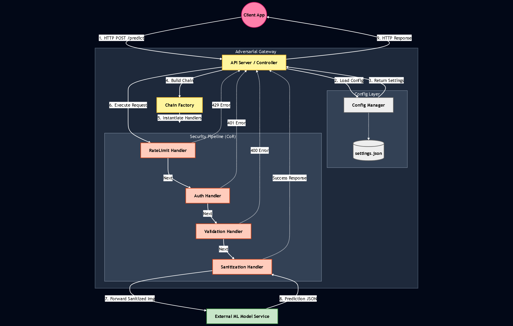
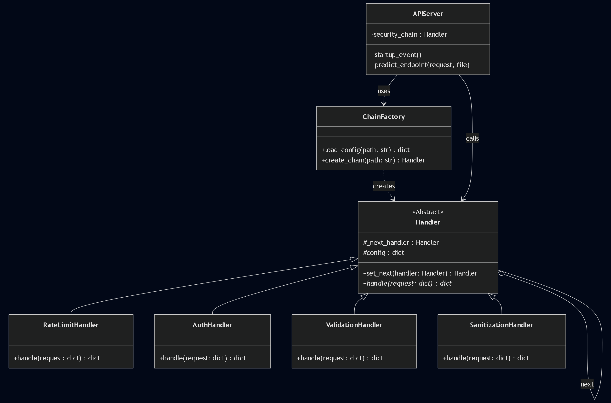

# 🛡️ Adversarial AI Gateway

A resilient security middleware architecture designed to protect Machine Learning models from adversarial attacks and malicious inputs using the **Chain of Responsibility** design pattern.

This project emphasizes **"Quality by Design"**, providing a proactive defense shield that isolates security logic from core AI business logic.

## 🏗️ System Topology & High-Level Architecture

The system topology is centered on the **Gateway pattern**, which acts as a facade to hide the complexity of underlying subsystems (Payments, Social, Coffee Shop, and Navigation) while providing a unified and consistent RESTful interface.


*Figure 4.1: High-level system architecture. Incoming HTTP requests are handled by the Uvicorn ASGI server and forwarded to the FastAPI application, where they must pass through a mandatory security pipeline.*

## 🔒 Security Management: Chain of Responsibility

A critical aspect of this architecture is centralized security management. Instead of duplicating checks across every endpoint, we implemented a middleware pipeline based on the **Chain of Responsibility** (GoF) behavioral pattern. This addresses the need to process requests through multiple sequential filters, where each step has the authority to interrupt the flow (e.g., if an attack is detected) or pass it to the next handler.


*Figure 4.2: UML Class Diagram of the Security Pipeline. Each handler maintains a reference to the next. If a check fails, an HTTP exception is raised; otherwise, the request flows to the Business Logic.*

### Implemented Security Handlers
| Handler | Responsibility |
| :--- | :--- |
| **SanitizationHandler** | First level of defense; cleans inputs of potential injections (XSS, SQLi) or malformed characters. |
| **RateLimitHandler** | Protects against Denial of Service (DoS) attacks by limiting request frequency per client. |
| **AuthHandler** | Verifies the presence and validity of authentication tokens in HTTP headers. |
| **ValidationHandler** | Ensures payload structural integrity against the expected JSON schema. |

## 🚀 Key Features
- **Design Pattern Integration:** Leverages **Adapter** (to decouple external providers), **Observer**, **Decorator**, and **Strategy** patterns for maximum extensibility.
- **Configurable Security:** Security chains can be modified via `settings.json` without altering the core codebase.
- **High Performance:** Built with **FastAPI** for asynchronous (async/await) execution.
- **Containerized Deployment:** Environment isolation and total portability via **Docker**.

## 📂 Project Structure
- `src/core`: Factory logic and chain construction.
- `src/handlers`: Concrete implementation of security handlers.
- `config/`: JSON configuration files.

## 🛠 Installation & Execution

### Option A: Using Docker (Recommended)
1. Ensure Docker Desktop is running.
2. Run the following command:
   ```bash
   docker-compose up --build
   ```
3. The server will start at http://localhost:8000

### Option B: Local Python Execution
If you prefer running locally without Docker:
1. Create and activate a virtual environment.

   # Windows
   ```bash
   python -m venv venv
   .\venv\Scripts\activate
   ```

   # Mac/Linux
   ```bash
   python3 -m venv venv
   source venv/bin/activate
   ```

2. Install dependencies:
   ```bash
   pip install -r requirements.txt
   ```

3. Run the server (as a module):
   ```bash
   python -m src.server
   ```

## 🧪 Testing
We included an automated test suite to validate the security chain against various attack vectors (No Token, Bad File Format, DoS Attacks).

With the server running, open a new terminal and run:
```bash
python demo_client.py
```

### Expected Output
The test suite will simulate 4 scenarios:

- **Scenario 1 (Auth Attack):** `401 Unauthorized` (Blocked ✅)
- **Scenario 2 (Malicious File):** `415 Unsupported Media Type` (Blocked ✅)
- **Scenario 3 (Valid User):** `200 OK` (Sanitized & Processed ✅)
- **Scenario 4 (DoS Attack):** `429 Too Many Requests` (Blocked by Rate Limiter ✅)
